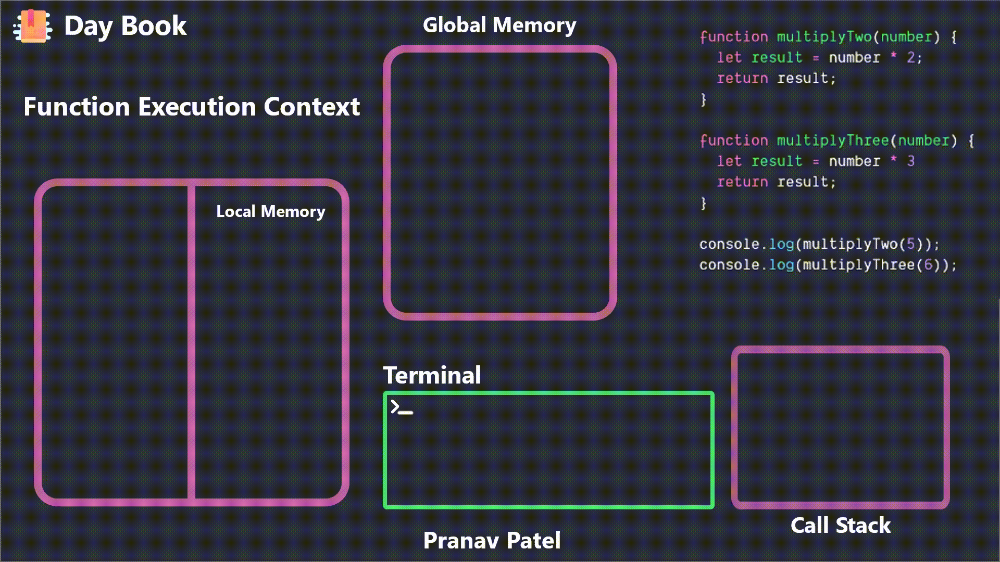

### Key list 
1. **Thread**
2. **Global execution context**
3. **Execution context**
4. **CallStack**

#### Thread
- javascript is a single threaded 
- Execution is done line by line

### Global execution context (GEC)
-  This is the default execution context in which JS code start its execution when the file first loads in the browser. All of the global code 
- i.e. code which is not inside any function or object is executed inside the global execution context. 
- GEC cannot be more than one because only one global environment is possible for JS code execution as the JS engine is single threaded.

### Execution context
- the environment in which the **JavaScript code** is **executed**. By environment, 
- I mean the value of this , variables, objects, and functions JavaScript code has access to at a particular time.
- 

### CallStack
-

